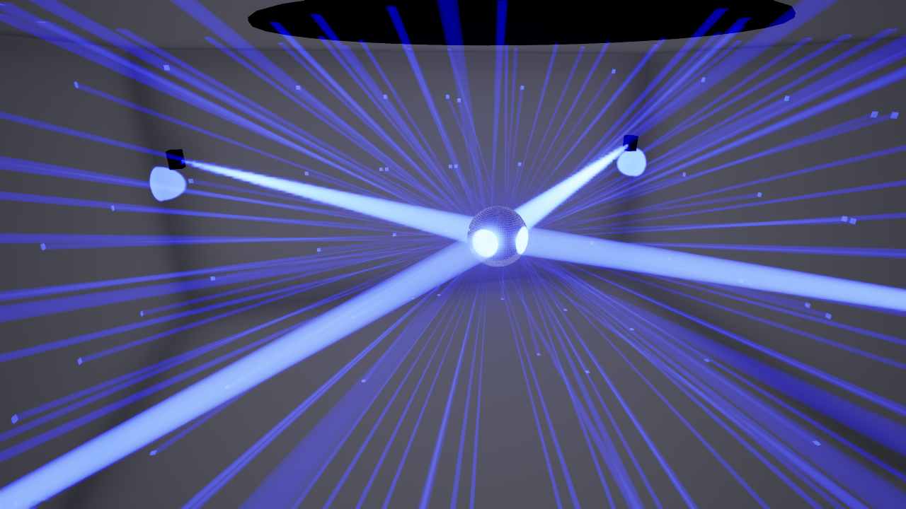
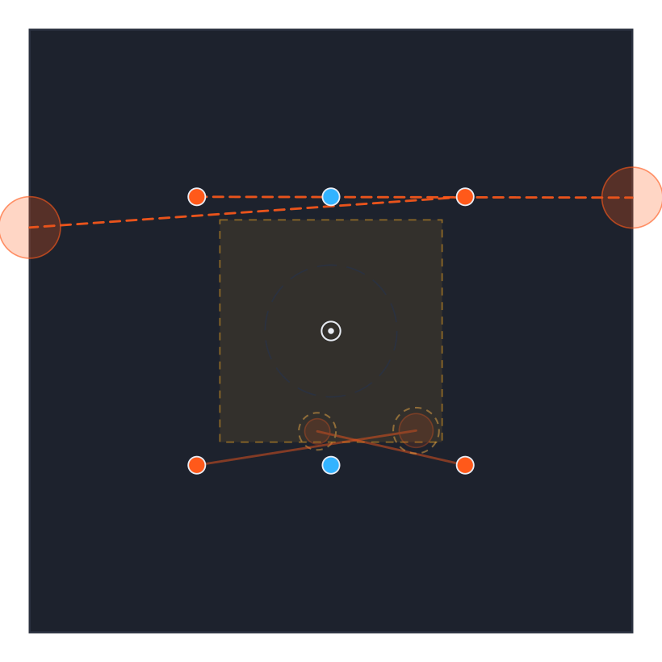
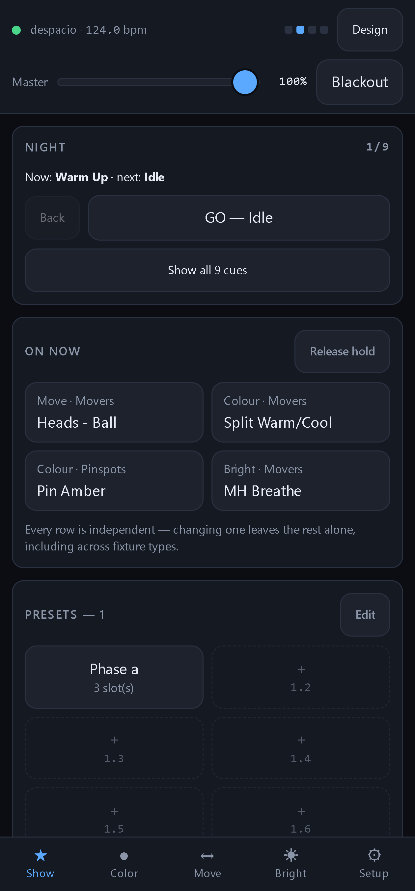
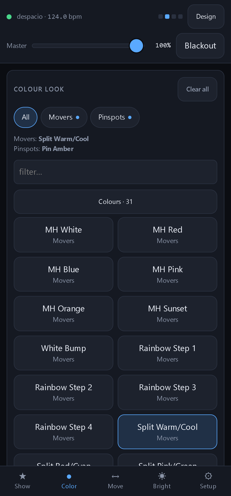
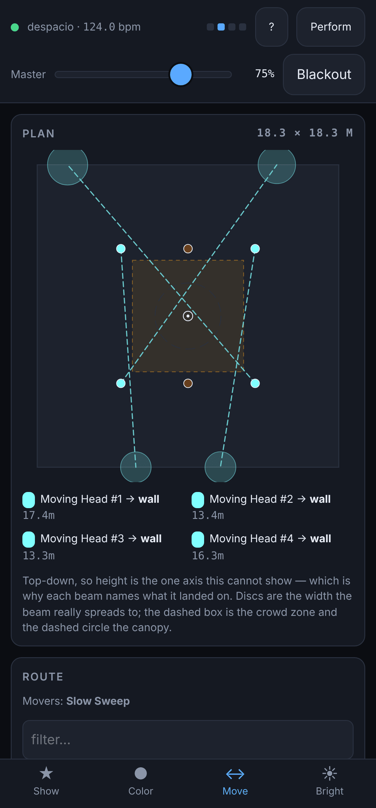
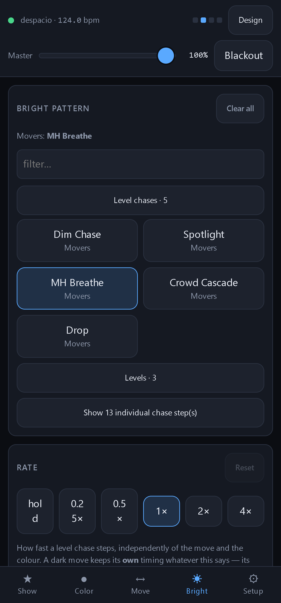
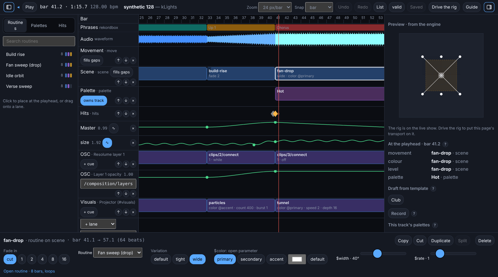
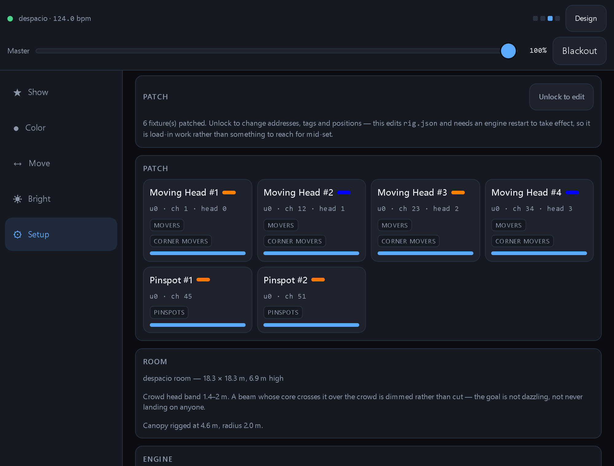

# kLights

A lighting console for a small moving-head rig, with 3D previsualization.

It runs a **parametric show engine**: it holds parameters rather than stored DMX
values, owns its own 40 fps frame clock, knows the room in three dimensions, and
dims beams that get near people. You drive it from a phone. Unreal renders it by
listening to the same Art-Net the rig hears.

**Nothing needs installing.** The engine is stdlib-only Python and the web
console ships pre-built, so a show laptop needs a checkout and a Python.

> ⚠️ Read [`docs/SAFETY.md`](docs/SAFETY.md) before pointing this at people. The
> beam taper is a **comfort feature for LED beams, not a protective device**,
> and two things on this rig are a different category: **strobe** (nothing
> limits the rate, and photosensitive epilepsy is a real risk) and **lasers**.

---



*The Unreal previz — the same Art-Net the rig receives, rendered in 3D.*



*The console's plan view: the room from above, every lit beam drawn to where it
actually lands, at the width it actually spreads to. No GPU, no install — this
runs on the show laptop.*

## Quick start

```bash
git clone <this repo>
cd kLights
python -m engine.server
```

That runs the despacio show against a **null output** — no DMX on the wire —
which is the safe way to try it with a rig plugged in. Open the URL it prints
(including its `?token=`) on a phone or a laptop.

To actually drive a rig:

```bash
python -m engine.server --artnet 255.255.255.255
```

Useful flags: `--event` (which show), `--port`, `--bpm`, `--bind`, `--token` /
`--no-token`, `--sync-port` (tempo from a DJ), `--show-dir` (prepped tracks
and their timelines -- see [Timecoded shows](#timecoded-shows)). `--help`
lists them all.
`--artnet` takes a list, so one engine can feed the rig's node and a previz on
the same laptop: `--artnet 10.0.0.50,127.0.0.1`.

Or double-click **`kLights.pyw`** (`python -m launcher` from a terminal): one
window to pick the event, start and stop the engine, open the console, its
Setup tab or Studio, copy the phone link, and launch or build the 3D previz.
The engine runs as its own process, so closing the launcher does not stop a
show, and reopening it finds the engine again.

Before a show, run everything that must be green:

```bash
python scripts/preflight.py
```

## Using the console

The console is a **web app the engine serves itself** — no install, no pairing,
no app store, and nothing to keep in sync. Open the URL the engine prints and
you are on the desk. It is built for a phone in one hand; on a laptop the tab
bar becomes a side rail and the panels widen.

<table>
<tr>
<td width="50%"></td>
<td width="50%"></td>
</tr>
<tr align="center"><td><b>Show</b></td><td><b>Color</b></td></tr>
<tr>
<td width="50%"></td>
<td width="50%"></td>
</tr>
<tr align="center"><td><b>Move</b></td><td><b>Bright</b></td></tr>
</table>

Five tabs, all driven by the same live state.

| tab | what it is for |
|---|---|
| **Show** | the cue list, preset banks, tempo and tap, auto mode, DJ sync, panic |
| **Color** | colour looks, a quick palette, a per-fixture picker, colour rate |
| **Move** | the plan view, movement routes, shape macros, movement rate |
| **Bright** | level patterns, hand dimming, momentary flash, strobe policy |
| **Setup** | the rig, the room, calibration and the patch editor |

Master and Blackout are in the header on every tab.

**Several people can be on it at once.** Every client sees the same state over a
WebSocket, and Setup shows who is connected and who last touched what. There is
no locking and no claiming — you can see each other instead, which is how two
people on a desk actually works.

**Perform / Design** is in the header too. Perform hides Setup and the read-only
diagnostics, leaving only what drives the show; Design is everything, including
the **Studio** button that opens the show-making app in a tab of its own (see
[Timecoded shows](#timecoded-shows)). It defaults to Perform on a phone and
Design on a laptop and is always one tap from the other. It is a preference
about screen space, **not** a permission — access is what `--token` decides.

Three ideas make the rest make sense:

- **Movement, colour and level are independent slots.** Picking a colour does
  not disturb the move. Each has its own rate, so a colour chase can crawl under
  a move running flat out.
- **Presets are pages of eight pads**, and a pad is a *place*. Saving over a
  preset keeps its pad; adding or deleting neighbours does not shuffle it.
- **The cue list is the night**, and GO walks it. A guest who knows nothing
  about the rig can run the whole show off one button.

**The console explains itself.** The **?** in the header opens a guide to the
tab you are on: a short walkthrough and the things worth knowing. A first visit
on each device offers a two-minute tour. Cards whose controls do not say what
they do (Tempo, Auto, Track, the quick palette's long-press, the safety taper,
calibration) have a **?** by their title that opens an explanation in place. A
tap, not a tooltip, because a phone has no hover. Studio has its own
**Guide**, offered on a first visit.

## Running a show

Full procedure for the day, including what to do when something breaks:
**[`docs/runbook.md`](docs/runbook.md)**.

## Previz

The previz is a **listener**: it watches the same Art-Net the rig does, so it
can never break a show. The standalone app needs no editor and no Python to
run, and draws whatever event the running engine is driving:

```bash
python previz/build.py                    # once; needs Unreal 5.8 to BUILD
previz/dist/Windows/KLightsPreviz.exe     # beside python -m engine.server
```

The launcher does both from buttons. The original editor-driven path still works
beside it (`python previz/doctor.py` checks either). See
[`previz/README.md`](previz/README.md).

The console's own plan view needs none of that and runs anywhere.

## Tempo from the DJ

The engine can take tempo, bar phase and **phrase** from the players rather than
from a tapped downbeat:

```bash
python -m engine.server --sync-port 9000
python bridges/prolink/bridge.py --fake      # no hardware needed
```

**No audio analysis happens here.** Beat position and rekordbox's phrase labels
are a *read*, not a derivation, so everything that knows what a CDJ is lives in
a sidecar. CDJs via beat-link-trigger; a DDJ-1000 via rkbx_link, since a DDJ is
USB and never speaks Pro DJ Link at all. Both emit OSC and the engine reads
both. See [`bridges/prolink/README.md`](bridges/prolink/README.md).

## Timecoded shows

For a signature track, the lights can follow **which track is playing and where
in it**, not just the tempo: a show drawn bar by bar against the track, played
back on the night from the DJ's own position.



*Studio's timeline editor on the example show, given a waveform and a wave on
its size lane. rekordbox's phrases and the waveform run across the top, with
the timeline's lanes below them (the higher lane wins). The browser is on the
left. The rig from above and "who drives each lane" at the playhead are on the
right, and the selected clip is along the bottom.*

```bash
python -m engine.showfiles init shows/              # a show folder (or use shared/show-example)
python bridges/rekordbox/prep.py --show-dir shows/ db --playlist Friday
python -m engine.server --show-dir shows/ --sync-port 9000
```

1. **Prep** reads what rekordbox already knows -- identity, beat grid, phrases,
   cues, waveform -- from rekordbox's own database (or an XML export) and its
   analysis files, into the show folder. Easier still: Studio's sidebar
   browses rekordbox's playlists and adds what you tick, drafting each a
   timeline from a template set in the same step
   ([`bridges/rekordbox/`](bridges/rekordbox/README.md); the database route
   needs `pip install sqlcipher3` and the key). Each track is then the same song
   to rekordbox and to CDJs playing any stick exported from it. No audio
   analysis of our own.
2. **Design** in **Studio**: the **Studio** button in the console's header
   (Design mode), the launcher's **Open Studio**, or the engine's URL with
   `#studio` on the end -- on a computer (a phone never downloads it). It opens
   on a **library** of every track in the show: what lights it on the night,
   its phrases, and what needs attention. A track's **timeline** is a set of
   lanes against its waveform and phrases:
   - scene, movement, colour, level and palette lanes, holding routines, looks
     and presets;
   - hits (flash, strobe, blackout);
   - automation of master, size, spread, centre, rate and any parameter of the
     routines on it. Any automation lane can carry a **wave** (sine, triangle,
     ramp, saw, square, hold) on top of its points.

   A browser on the left places routines, palettes and hits. A phrase is a
   section you can fill, copy and paste, and clips copy, cut, duplicate and
   split. Draft a first pass from a template set, tap hits in with the Record
   pads, or edit the list. **Drive the rig** plays the draft you are editing on
   the real rig, from the page's own audio. **+ New** makes a timeline, a
   routine, a template set or a palette. Routines are reusable rows on roles
   (movers, pinspots), with open parameters and variations. They have a library
   (folders, where each is used, rename and delete) and an editor of their own,
   where a lane can also move one block's argument. Template sets, the show's
   palette library and show.json's settings each have a page. Undo, Ctrl+S,
   Space and Delete work as you would expect. Every save quotes the version it
   opened, so a change made elsewhere is never overwritten.
3. **Play.** The engine matches the DJ's track against the folder (CDJs via
   beat-link-trigger, a DDJ via rkbx_link -- see
   [`bridges/prolink/`](bridges/prolink/README.md)). On the phone's **Track**
   card, arm **Follow** and the matched track's timeline drives the rig;
   picking a look grabs that lane back until you release it.
4. **Templates** cover everything else: a template set maps rekordbox's phrase
   labels (Intro, Verse, Up, Chorus, Down...) to routines, so a prepped track
   with no timeline, the gaps in a timeline, and a guest DJ's track the folder
   has never seen all get a show -- from the deck's live phrase, or a cycle
   every N bars when there is none. Studio edits a set phrase family by
   phrase family, and shows what it would draft on any track. Switch set live
   from the Track card; it lands on the next downbeat. A preset pad can carry a
   routine too, starting on the next downbeat when pressed. With CDJs, what the
   other decks have loaded is matched and its show built while the DJ cues it,
   so a master switch is on its timeline from the first frame.
5. **VJ.** An OSC lane in Studio cues a VJ app (Resolume, or anything
   that takes OSC) as the track plays -- clip triggers on, off and while
   playing, and curves -- and a routine can carry one too, so templates cue
   it on tracks nobody drew. MIDI lanes do the same for MIDI gear, through a
   small sidecar ([`bridges/midi/`](bridges/midi/README.md)) that owns the
   MIDI port. For a VJ app with its own timeline per track,
   `outputs.timecode` sends Art-Net timecode at the DJ's position in the
   track -- it jumps with loops and hot cues. Say where under `outputs` in
   show.json, or per machine in `klights.local.json`. Or skip the VJ app: open
   **`#visuals`** on a laptop on the projector for kLights' own scenes (wash,
   bars, tunnel, particles, strobe, and videos from the folder's `media/`),
   cued by a Visuals lane or by the template set phrase by phrase.

What is safe by default: Follow starts **disarmed** every time, because the DJ
feed arrives on an unauthenticated port; writing to the show folder and taking
the rig from Studio need the token; the audio endpoint serves only files
a track names, and only with the token; safety and the strobe policy run after
the timeline exactly as they run after everything else. The folder can live on
Dropbox or a NAS and is reloaded when it changes -- but never under a track
that is playing.

An assistant can read, lint, explain and edit the same folder through the MCP
server. The design record, with every decision and why, is
[`docs/design/timecoded-shows.md`](docs/design/timecoded-shows.md); the
example folder is [`shared/show-example/`](shared/show-example/README.md).
**Not yet run against real decks** -- the hardware checklist is in the design
record.

## Editing the rig

Three surfaces, one set of rules — every write goes through the same API and the
same validation:

```bash
python -m engine.newevent                       # a new show, interactively
python -m engine.patch add --name "Par 5" ...   # one-shot edits
```

- the **Setup tab** in the console, phone in hand at load-in
- the **MCP server** (`mcp/klights_mcp.py`), so an assistant can patch and
  describe the rig -- and read, lint, explain and edit the show folder's
  tracks, timelines, routines and template sets (dry runs unless asked, every
  write quoting the rev it read)
- the **CLI** above, which needs no UI

Edits are validated, written atomically, and applied to the running show without
a restart. A rig that will not load is refused and the old one keeps running.



*The Setup tab on a laptop — the same console, with the tab bar as a side rail.
The patch is read-only until you unlock it, because it is load-in work rather
than something to reach for mid-set.*

## Building the UI

Only needed if you change it — `ui/dist/` is committed so a venue needs no Node.

```bash
cd ui
npm ci
npm run dev      # live-reloading dev server
npm test         # 303 tests: the console against a fixture captured from a
                 # real engine, Studio against the example show folder
npm run build    # writes ui/dist/
```

CI rebuilds the bundle and fails if it differs from what is committed. That
check exists because a stale bundle ships a blank console to a venue, and it
nearly did.

## Tests

```bash
python -m engine.tests    # every suite, no test framework
cd ui && npm test         # the console and Studio
```

Engine suites are standalone scripts — run one directly with
`python engine/tests/test_clock.py`. Each runs in its own subprocess, since
several set process-wide timing and assert on wall-clock behaviour.

Two are load-bearing. `test_geometry_parity.py` compares every aim against the
code that drove the real show and requires agreement within one 8-bit step.
`test_qlc_parity.py` diffs whole DMX frames against QLC+ across the ported
library, and requires every differing channel to fall into a category that was
*derived* rather than assumed.

## Layout

```
engine/        the show engine — stdlib only, no dependencies
launcher/      the desktop window that starts the engine and the previz (Tk)
ui/            React console, Studio and #visuals; ui/dist is committed so a venue needs no Node
previz/        Unreal previz — an Art-Net listener, never in the show's path
bridges/       sidecars: DJ tempo and position, the rekordbox prep tool, MIDI out
mcp/           MCP server over stdio: the rig and the show folder, from an assistant
events/        one directory per show: patch, calibration, looks, cues, presets
shared/        things that outlive a show: fixtures, venues, inventory, tools
schemas/       JSON Schema, generated from engine/config.py
docs/          how it works, how to run it, and why it is like this
legacy/        the retired BlenderDMX path, kept for reference
spike/         the timing spike that settled the frame-clock question
```

**The organizing rule:** a file belongs to an event if it encodes *this rig or
this night*. It belongs in `shared/` if it describes *hardware we own*, *a room*,
or *a thing we do to any show*, and in `engine/` if it is show logic that does
not know which event it is running. Events come and go; the inventory, the
rooms, the tools and the engine carry forward.

A **room** is shared because it outlives any one show, so a second night in the
same room is a one-line change rather than a forked copy of the geometry the
safety taper reads.

## Documentation

| | |
|---|---|
| [`docs/runbook.md`](docs/runbook.md) | show night, start to finish |
| [`docs/SAFETY.md`](docs/SAFETY.md) | what the taper does and does not do |
| [`docs/engine.md`](docs/engine.md) | how the engine works, for changing it |
| [`docs/ROADMAP.md`](docs/ROADMAP.md) | what was built, why, and what is not |
| [`docs/models.md`](docs/models.md) | the standalone previz's models, set pieces and fixture bodies |
| [`docs/pipeline.md`](docs/pipeline.md) | Art-Net architecture; the QLC+ era |
| [`docs/design/timecoded-shows.md`](docs/design/timecoded-shows.md) | timecoded shows: decisions, formats, stages |
| [`docs/design/`](docs/design/) | working notes and measurements |
| [`CHANGELOG.md`](CHANGELOG.md) | notable changes, newest first |

## Requirements

- **Python 3.10+**, stdlib only — the engine, the tools and the previz host half
  have no pip dependencies at all. Two optional sidecars carry their own, behind
  a process boundary: reading rekordbox's database needs `sqlcipher3`, and MIDI
  out needs `bridges/midi/requirements.txt`.
- **Node 18+**, only to rebuild the UI. Never needed at a venue.
- **Unreal Engine 5.8**, only for the 3D previz.

## Licence

[Apache-2.0](LICENSE). Note the warranty disclaimer: this software aims light at
people, and its comfort model is documented, deliberately limited and
unvalidated. See [`docs/SAFETY.md`](docs/SAFETY.md).
