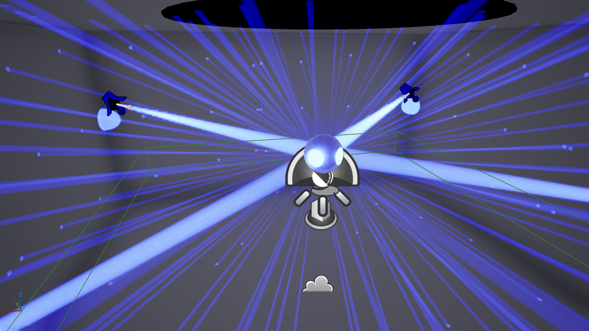

# Previz — the show engine, rendered in Unreal

How to run the 3D previz. The modelling notes that used to live here — fog,
beam gains, the mirror ball, what was measured and what is eyeballed — moved to
[`docs/design/previz-optics.md`](../docs/design/previz-optics.md).



Previz is a **listener**. The engine broadcasts Art-Net; this watches it. Nothing
here sits between the engine and the rig, so previz cannot break a show, and
F10 was always safe to build alongside everything else.

```
  engine.runner ──Art-Net UDP 6454──┬──▶ the rig
                                    └──▶ Unreal (klights_live.py)
```

## Running it

Needs Unreal Engine **5.8** (5.8.1 is what this was built against).

**1.** Open `previz/unreal/KLightsPreviz.uproject` in the editor and leave it
sitting on the Previz level. **Do not press Play.**

**2.** Build the level and start the driver — one command, safe to re-run any
time:

```bash
python previz/ue_remote.py previz/unreal/Content/Python/go.py
```

**3.** Send it some DMX from a second terminal:

```bash
python previz/ball_check.py --artnet 127.0.0.1 --seconds 300
```

The beams move in the ordinary editor viewport. That is the whole loop.

> **Play is not part of it.** The driver runs on the editor's tick, so the
> previz is already live without Play — and Play puts the editor into a mode
> where you cannot move the camera freely or edit anything. It does work (the
> driver follows the world into Play-in-Editor and back), but there is no
> reason to use it.

Re-run `go.py` after editing `venue.json` / `rig.json` / `calibration.json`, or
after editing anything under `Content/Python`. It reloads the modules, so your
edit really does take effect.

### Making the viewport look like the stills

Two viewport settings, both in the **level viewport's own toolbar** — the level
cannot reach either, which is why they are here and not in `build_level.py`:

1. **Exposure → tick "Game Settings"** (the ☀ dropdown). Unticked, the viewport
   applies its own exposure and *auto-adapts*, which is exactly what a dark room
   defeats: point a camera at black walls and it winds the gain up until they
   are grey, taking the show's contrast with it. Ticked, it obeys the level's
   `PZ_Look` volume, which pins exposure so a still is comparable with what you
   are looking at — and with the still you took last week.
2. **Press `G` for Game View.** Hides the editor's own furniture: light
   billboards, the grid, selection outlines, and the crowd-zone wireframe.

The stills are captured through the same pinned exposure, so with those two set
the viewport and `renders/` agree.

If nothing happens, ask the doctor first — every failure here looks the same
from a viewport, and each one has a different fix:

```bash
python previz/doctor.py
```

It checks the event resolves and its scene actually builds, that an Unreal
install with remote execution is findable, that the project is there, that an
editor is answering, and whether anything already owns Art-Net 6454. Non-zero
exit only for things that would genuinely stop a previz working.

Then, in order: is the editor open (`python previz/ue_remote.py
--ping`), is a sender running, and what does the driver say?

```bash
python previz/ue_remote.py -c "import klights_live; klights_live.status()"
```

Only **one sender at a time** — two both emitting to 6454 means the previz
samples whichever packet landed last, which looks like stuttering.

The host-side half runs with no Unreal at all, and is worth reading when
something looks wrong in 3D:

```bash
python previz/scene.py despacio -o scene.json
```

## Another event, another room

The previz builds whatever `previz/previz.json` names, and nothing in the
Unreal path knows the word "despacio" any more:

```bash
KLIGHTS_EVENT=cosmos26 python previz/ue_remote.py previz/unreal/Content/Python/go.py
```

`KLIGHTS_EVENT` beats the file on purpose — the file is what the repo is set up
for, the variable is one person looking at something else for ten minutes.
`python previz/config.py` prints which is winning.

The four snapshot cameras are **derived from the room** rather than measured in
it. They used to be literal coordinates, which put four cameras inside a wall
in any other venue; `scene.camera_views` holds the framing rules instead —
never on a diagonal (that is where the heads are), never on a mid-line (that is
where the pinspots are), above the truss, and inside the clear floor rather than
outside a cut-away wall. Run against despacio it reproduces the hand-measured
originals to within a centimetre, and the self-test builds a 6 m room and a
4 × 0.9 m corridor to check they stay inside a room that is not this one.

Optics — fog, beam gains, albedo — live in `previz/optics.json` per venue, with
the re-sweep procedure written in the file. A room with no profile inherits
despacio's numbers and the doctor says so, because inherited optics render
perfectly happily and render like somewhere else.

Anything that emits Art-Net will drive it:

```bash
python -m engine.demo --artnet 127.0.0.1 --seconds 300
```

To look at the mirror ball specifically, hold every head on it — `engine.demo`
orbits *around* the ball at 15–40°, so its reflections are correctly absent
almost the whole time, which looks exactly like a broken ball:

```bash
python previz/ball_check.py --artnet 127.0.0.1 --seconds 300
```

Stills go to `renders/` (gitignored) — an overview, a corner, what the audience
sees, and a close-up of the ball, which is the only view that can settle a
question about the tiling:

```bash
python previz/ue_remote.py previz/unreal/Content/Python/snapshot.py
```

Other useful one-liners:

```bash
python previz/ue_remote.py -c "import klights_live; klights_live.status()"
```

```bash
python previz/ue_remote.py -c "import klights_live; klights_live.stop()"
```

## Play in the editor

You do not need Play — see the runbook. It is supported anyway, and two things
had to be fixed to make it so; both are worth knowing because they bite the same
way.

**Nothing can be *built* during Play.** Not the actor subsystem, not the level
subsystem, and not the asset registry: `list_assets('/Game')` comes back **empty**
and `does_asset_exist` returns False for a map sitting on disk. Every call logs
`The Editor is currently in a play mode` and hands Python None. `go.py` now
refuses up front, because without that the build cleared the level and then died
on `'NoneType' has no attribute 'set_actor_label'` — and the honest reading of
that wreckage is "the rebuild deleted my map", which is wrong and sends you
looking in exactly the wrong place. Press Stop and re-run.

**Play duplicates the level into a separate PIE world.** The actors on screen
from that moment are the duplicates, so a driver holding editor-world actors
goes on updating things nobody is looking at and the beams freeze exactly where
they were. The driver re-resolves against whichever world is active on every
tick; `status()` reports the world and the rebind count.

**`EditorAssetLibrary` lookups do not resolve during Play.** `does_asset_exist`
returns False for an asset that plainly exists, and `load_asset` returns None.
Assigning that None to a mesh substitutes Unreal's DefaultMaterial — opaque and
unlit — so the reflection dots turned into black spheres the instant Play was
pressed. Nothing in the driver looks a material up by path any more; it
instances from the material already on the mesh (`_shared_material`).

## Known gaps

- **The ball's size is unmeasured, and it is a safety number.** `venue.json`
  says `ball_radius: 300`, set by hand on 2026-08-07 over an estimated 200. The
  taper treats the ball as an occluder, so a *bigger* ball means it believes
  more beams are blocked and dims less — the direction that errs toward not
  dimming. Measure the real one; previz follows, since it reads the same file.
- **`APERTURE_MM` is a guess** — 40 mm for the lens of a small 60 W fixture. It
  sets how big every mirror-ball dot is and nothing else.
- **The pinspots' placement is stated, not measured.** Same plane as the movers
  (y 2971), centred on two opposing sides of the truss, inset by the same 500 mm
  they are — recorded 2026-08-07. If "north/south" meant the *other* pair, swap
  x and z in both pinspots' `position` in `rig.json`; nothing else changes.
- **The room's new size is stated, not measured.** As of 2026-08-07 it is twice
  as long and twice as wide with a 6.9 m ceiling, and the rig hangs on a
  free-standing 9.144 m truss frame in the middle of it rather than on the
  walls — `venue.json`'s `truss` block. The room is assumed to have grown
  *symmetrically* about the rig; if the truss is really off-centre, move the rig
  rather than the room, because every coordinate in `rig.json` is measured from
  that frame. The bar is drawn as a 60 mm pole, which is a drawing choice and
  nothing else depends on it.
- **No fixture's real output is measured.** Everything comes from the `.qxf`'s
  Bulb Lumens — 1300 for a head, 48 for a pinspot — and that is emitter output,
  not what clears the lens, so the ratio between a narrow and a wide fixture is
  overstated by an unknown amount. `MESH_CONTRAST` papers over it; a measured
  number in `rig.json` would fix it. Most `.qxf` files in the wild declare 0,
  which falls back to `scene.UNDECLARED_LUMENS` (400).
- **A wide fixture's reflections are sampled, not drawn in full.** An 11°
  pinspot overshoots a 60 cm ball at 4 m and lights its whole near cap — about
  441 facets, against a 3° head's 35 — and drawing every one for both pinspots
  put the tick at 15.9 ms against a baseline of 4. Each fixture gets a **facet
  stride**, worked out once from its beam angle and its fixed distance to the
  ball (`mirrorball.lit_facets`) so `lit / REFLECT_BUDGET` facets are drawn:
  1 for the heads, 3 for the pinspots. Same kind of sampling `REFLECT_SPACING_MM`
  already is (the ball wears 3698 mirrors and reflects off 882), one step
  further and only where it is needed. `status()` says when it bites.

  It skips by **lattice index**, not by position in the hit list, and that
  distinction is the whole thing. Thinning the *results* — which is what this
  replaced — re-picks a different subset whenever the hit count changes by one,
  so several hundred dots each jump to a neighbouring facet every few frames and
  the spray reads as a crawling moire rolling across the room. Skipping by index
  picks the same mirrors every frame; they enter and leave the beam as the ball
  turns, the way real ones do.

